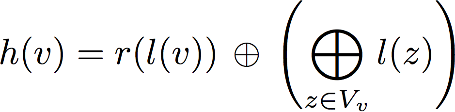

<figure>
    
</figure>

That Android malware is still sky rocketing in third-party markets is old news, but the truth is that mobile devices are without a doubt more personal and used than ever (around 120 billion applications downloaded from official markets and counting). Loaded with private information and linked to a bank account, they are and will continue to be a gold mine for criminals. Even more if Android end up being the de facto OS for embedded devices.

On one hand, several techniques combining the static analysis of disassembled DEX code and machine learning have been proposed so far to detect Android malware at a large-scale. Most of them, based on expert features such permissions or the usage of sensitive API functions. In general, these mechanisms are easy to circumvent using kernel-level exploits or API-level rewriting. On the other hand and as we have seen for a long time with x86 malware, the majority of new Android malware samples are variations of existing malware. In most cases, legitimate apps are downloaded from the official market, modified to include malicious functionality and uploaded to a third-party market. If different malware samples include the same piece of malicious code, they may be not identical to the original apps and somehow similar to each other. Accordingly, detecting similarities has shown to be an effective approach to find new samples in the wild.  Malware writers introduce very often modifications to thwart such methods (instructions may be reordered, branches may be inverted within functions, the allocation of the registers may change, etc), so we wonder if it is possible to learn on features less susceptible to local modifications. The function call graph at the Dalvik level tend no to be modified by changes of the Java code and retains a lot of the static behavioral information of the binary. This makes it an interesting candidate to explore its effectiveness as a feature for malware detection. If we focus only on the call graphs and the similarity between different samples, we can transform the malware detection problem into a graph classification problem. Considering the large-scale problem, we wonder if it is possible to detect android malware samples using only their structural information while taking advantage of recent machine learning techniques developed particularly to classify graphs. This is, instead of using just numerical features or serializing the call graphs as strings.

The graph classification problem is linked to the graph similarity problem which is, in general, computationally very hard. For example, classic techniques as the Graph Edit Distance, which measures the number of basic operations needed to transform one graph into another, or some spectral techniques (suboptimal approximations to the GED) are P-complete. Kernel-based Support Vector Machines have been proven extremely powerful for classification tasks and Graph Kernels have emerged as a solution to let the SVM operate efficiently in the graph space. More specifically, graph kernels measure the similarity between two graphs without an explicit construction of the feature vectors.

In our problem and as malicious functionality in Android applications often concentrates in a small number of functions, we want to be able to classify the samples as a function of their shared common substructures. Roughly, we take the following steps:

* An abstraction of the Dalvik instruction set is defined, where every op-code is assigned a category. Then, each function is labeled with a 15 bit label, where every bit indicate that the function contains op-codes from a certain category.
* The binary labels of the functions in each neighborhood are used to compute a hash that allows to enumerate the substructures in the graph using the next formula, where l(v) is the label of the node v and r() is the 1-bit rotation operation:

 <figure>
   
 

</figure>

* The neighborhood hash graph kernel, evaluates the count of common identical substructures in two graphs, but instead of feeding the kernel matrix to the SVM we want to create an explicit representation that is equivalent to that of the kernel. This will allow us to understand the decisions made by the SVM, something essential for the malware analyst once a sample have been flagged as malicious. And here goes the trick: we map the histogram H of binary labels in a graph to a vector in the following way, where M is the maximum value for all the histograms in the dataset and a is the value of each bin in H: 

<figure>
    

</figure>         

The inner product in the vector space induced by the equation resembles the neighborhood hash graph kernel but allow us to identify what functions contribute to the decision of the SVM once the expansion performed by the mapping is reversed.

Once a classification model is learnt we can check the outcome of the method in a more clarifying and down to earth example. The following code shows a fragment from a sample known by some AV engines as RuFraud-C. This very simple malware builds and sends an SMS to a series of premium services in Russia.


onCreate(Landroid/os/Bundle;)V
[…]
invoke-static        Lcom/loadfon/fileloader/SmsClass;->getSms()Ljava/util/List;
[…]
getSms()Ljava/util/List;
[…]
const-string         v2, '5373'
const-string         v3, '5+125 2-3-667-13232405195300'
[…]
run()V
[…]
invoke-static        v3, v4, v2, Lcom/loadfon/fileloader/FileloaderActivity;->
						access$300(Lcom/loadfon/fileloader/FileloaderActivity;
						Ljava/lang/String; Ljava/lang/String;)V
[…]
access$300(Lcom/loadfon/fileloader/FileloaderActivity; Ljava/lang/String;
           Ljava/lang/String;)V

invoke-direct        v0, v1, v2, Lcom/loadfon/fileloader/FileloaderActivity;->
					    sendSms(Ljava/lang/String; Ljava/lang/String;)V
return-void   


The path formed by the functions run(), access$300 and finally sendSMS() led to the sending of the SMS. Now if we take a look at the weights that the method has assigned to the different functions in the call graph, we can see how this is precisely the call path that has been highlighted by the algorithm.

<figure>
    
</figure>         

In an evaluation with more than 130k clean apps and 12k malware samples, the computation of all the neighborhood hashes in a call graph can be completed in linear time with the size of the application. In terms of detection, the method reaches a 89% detection rate with 1% false positives (1 in 100 installed apps), but we need to remember that this is achieved purely relying on the structural properties of the code at the function level. So of course, to improve the final performance, the method can be used in combination with other techniques based on different static or dynamic features.

<figure class="half">
    
    
</figure>

If you feel like diving into the details of the method, you are always welcome to read the paper, check our [implementation](https://github.com/hgascon/adagio) available at github and give some feedback!

> 

[**Structural Detection of Android Malware using Embedded Call Graphs**](http://prosec-project.org/docs/2013b-aisec.pdf) 
Hugo Gascon, Fabian Yamaguchi, Daniel Arp, Konrad Rieck 
*ACM Workshop on Security and Artificial Intelligence (AISEC) November 2013*
