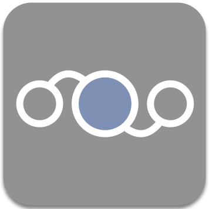

### PULSAR

#### Protocol Learning, Simulation and Stateful Fuzzer

 
Pulsar is a network fuzzer with automatic protocol learning and simulation capabilites. The tool allows to model a protocol through machine learning techniques, such as clustering and hidden Markov models. These models can be used to simulate communication between Pulsar and a real client or server thanks to semantically correct messages which, in combination with a series of fuzzing primitives, allow to test the implementation of an unknown protocol for errors in deeper states of its protocol state machine. Try it [here](https://github.com/hgascon/pulsar)!
  

### ADAGIO

#### Structural Analysis and Detection of Android Malware

 
Adagio is a collection of Python modules for analyzing and detecting Android malware. These modules allow to extract labeled call graphs from Android APKs or DEX files and apply an explicit feature map that captures their structural relationships. Additional modules provide classes for designing binary or multiclass classification experiments and applying machine learning for detection of malicious structure. Find the code at its GitHub [repository](https://github.com/hgascon/adagio). 
  

### ACAPULCO

#### Attack Community Graph Construction

 
The Honeynet Project Acapulco app bundles a Splunk application that can be deployed on a central server to automatically generate meta-events from several hpfeeds channels. This events are clustered using DBSCAN or K-means algorithms and displayed at an external client using parallel coordinates graphs based on the D3.js visualization library. The first release was supported by the Google Summer of Code 2012 program and mentored by The Honeynet Project. The code can be found at its GitHub [repository](https://github.com/hgascon/Acapulco4HNP).
